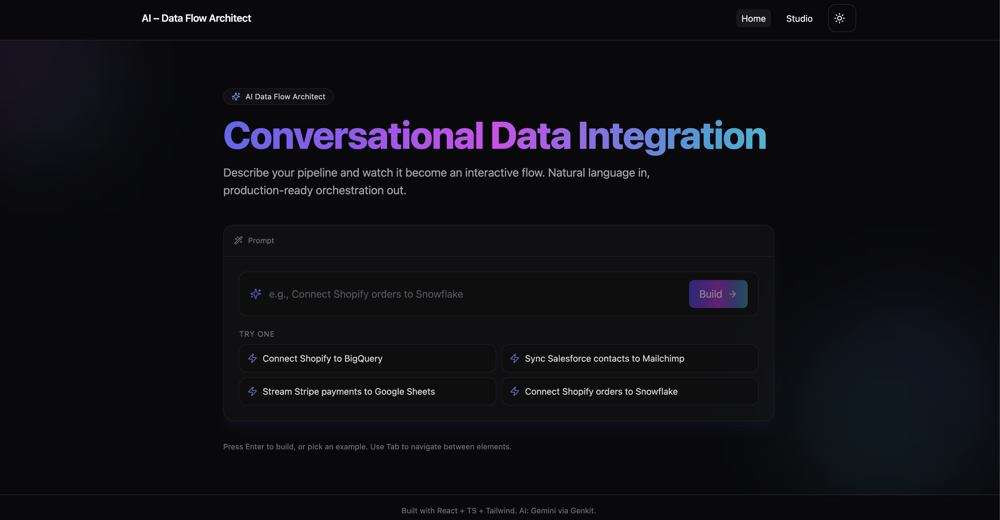
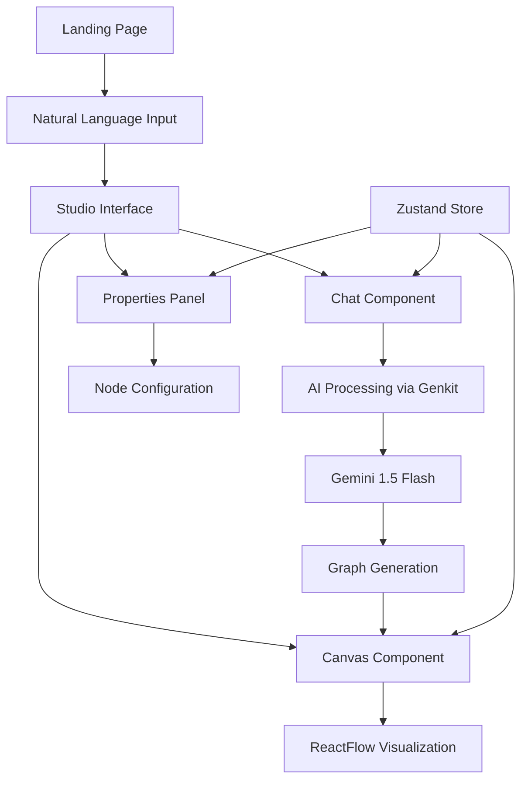

# AI Data Flow Architect

A React + TypeScript + Tailwind app that turns natural language data flow prompts into an interactive canvas.
Gemini (via Genkit) powers clarifying questions in the chat to build production-ready data pipelines.

## About This Application

AI Data Flow Architect is an intelligent visual pipeline builder that bridges the gap between business requirements and technical implementation. Instead of manually creating complex data flow diagrams, users can simply describe their data processing needs in plain English, and the AI will generate interactive, configurable pipeline visualizations.

### Key Capabilities

**🧠 Intelligent Pipeline Generation**: Describe your data flow requirements conversationally - "I need to sync Shopify orders to Snowflake and send email notifications" - and watch as the AI creates a complete visual pipeline with all necessary components.

**💬 Interactive AI Assistant**: The built-in chat interface doesn't just generate pipelines; it asks clarifying questions to ensure accuracy, suggests optimizations, and helps refine your data architecture in real-time.

**🎨 Visual Pipeline Editor**: Each generated pipeline appears on an interactive canvas where you can drag, connect, and configure nodes. The visual representation makes complex data flows easy to understand and modify.

**⚙️ Dynamic Configuration**: Every pipeline component comes with a contextual properties panel, allowing you to configure API endpoints, transformation rules, scheduling, and other technical details without writing code.

**🔄 Production-Ready Output**: The generated pipelines aren't just diagrams - they represent real, implementable data architectures with proper error handling, monitoring, and scalability considerations.

> **Stack**: React 18, TypeScript, Tailwind CSS, React Router, Zustand, ReactFlow, Lucide Icons  
> **AI**: Google Gemini 1.5 Flash via Genkit, exposed with a Netlify Function  
> **Accessibility**: WCAG 2.1 AA compliant with full keyboard navigation and screen reader support

## 🎥 Application Demo

Watch the AI Data Flow Architect in action:

[](https://github.com/user-attachments/assets/123bc500-c9ca-438a-9432-71033d2f3ef4)

> 🎬 **Click the thumbnail above to watch the full demo video**

_The video demonstrates the complete workflow from natural language input to interactive pipeline visualization, showcasing AI-powered conversations and real-time canvas updates._

### What You'll See in the Demo:

- 🗣️ **Natural Language Input**: Enter data flow requirements in plain English
- 🤖 **AI Conversation**: Interactive chat that asks clarifying questions
- 🎨 **Live Canvas Updates**: Watch nodes and connections appear in real-time
- ⚙️ **Property Configuration**: Dynamic property panels for each pipeline component
- 📱 **Responsive Design**: Seamless experience across desktop and mobile devices

## Features

- 🤖 **AI-Powered Pipeline Creation**: Natural language to visual data flows
- 🎨 **Interactive Canvas**: Drag-and-drop interface with ReactFlow
- 💬 **Conversational Interface**: Chat-based pipeline configuration
- ♿ **Fully Accessible**: Complete keyboard navigation and screen reader support
- 🌓 **Dark/Light Theme**: Automatic theme switching with system preference
- 📱 **Responsive Design**: Works on desktop, tablet, and mobile devices
- ⚡ **Real-time Updates**: Live status indicators and property editing

## Prerequisites

Before setting up the project locally, ensure you have:

- **Node.js** (v18 or higher) - [Download here](https://nodejs.org/)
- **npm** (comes with Node.js) or **yarn**
- **Google API Key** for Gemini AI - [Get one here](https://makersuite.google.com/app/apikey)
- **Git** for version control

## Local Development Setup

### 1. Clone the Repository

```bash
git clone <repository-url>
cd ai-dataflow-architect
```

### 2. Install Dependencies

```bash
npm install
# or
yarn install
```

### 3. Environment Configuration

Create a `.env` file in the project root:

```bash
# Required: Google API Key for Gemini AI
GOOGLE_API_KEY=your_google_api_key_here

# Optional: Custom API base URL (defaults to Netlify function)
VITE_API_BASE=http://localhost:8888/.netlify/functions
```

> **Important**: The `GOOGLE_API_KEY` runs server-side in the Netlify Function, so no `VITE_` prefix is needed.

### 4. Start Development Server

```bash
# Using Netlify Dev (Recommended - includes serverless functions)
npx netlify dev

# Alternative: Vite only (frontend only, no AI features)
npm run dev
```

### 5. Access the Application

- **Full App**: http://localhost:8888 (with Netlify Dev)
- **Frontend Only**: http://localhost:5173 (with Vite dev)

## Application Architecture

### How It Works



### Application Flow

1. **Landing Page**: User enters natural language prompt (e.g., "Connect Shopify to Snowflake")
2. **Initial Setup**: System creates basic 3-node pipeline (Source → Transform → Destination)
3. **AI Conversation**: Chat interface asks clarifying questions about:
   - Data source configuration (API keys, endpoints)
   - Transformation requirements (field mapping, filtering)
   - Destination settings (database credentials, table structure)
4. **Graph Generation**: AI processes responses and generates complete pipeline configuration
5. **Visual Canvas**: ReactFlow renders interactive pipeline with:
   - Node status indicators (pending, partial, complete, error)
   - Connection handles for linking nodes
   - Real-time property editing
6. **Configuration**: Properties panel allows fine-tuning of node settings via JSON editor

### Component Structure

```
src/
├── components/           # Reusable UI components
│   ├── Canvas.tsx       # ReactFlow-based pipeline visualization
│   ├── Chat.tsx         # AI conversation interface
│   └── PropertiesPanel.tsx # Node configuration editor
├── pages/               # Route-level components
│   ├── Landing.tsx      # Homepage with prompt input
│   └── Studio.tsx       # Main workspace (3-panel layout)
├── context/             # React Context providers
│   └── LayoutContext.tsx # UI state management
├── store/               # Zustand state management
│   ├── useFlowStore.ts  # Pipeline data (nodes, edges)
│   └── useSlots.ts      # Configuration slots (API keys, etc.)
├── lib/                 # Utility functions
│   └── ai.ts           # AI integration helpers
└── styles/              # CSS and styling
    └── accessibility.css # Accessibility enhancements
```

### State Management

- **Flow Store** (`useFlowStore`): Manages pipeline nodes, edges, and selection
- **Slots Store** (`useSlots`): Handles service configurations (Shopify, Snowflake, etc.)
- **Layout Context** (`LayoutContext`): Controls UI density and panel visibility

## API Integration

### Netlify Function

The AI functionality is powered by a Netlify Function at `/netlify/functions/ai.ts`:

```typescript
// Handles POST requests to /.netlify/functions/ai
// Processes chat messages and returns AI responses with optional graph data
```

### Custom API Base

To use a different API endpoint, set `VITE_API_BASE` in your `.env` file:

```bash
VITE_API_BASE=https://your-api-domain.com/api
```

## Available Scripts

```bash
# Development
npm run dev          # Start Vite dev server (frontend only)
npx netlify dev     # Start with Netlify functions (recommended)

# Building
npm run build       # Build for production
npm run preview     # Preview production build

# Code Quality
npm run lint        # Run ESLint
npm run type-check  # TypeScript type checking

# Deployment
netlify deploy      # Deploy to Netlify
netlify deploy --prod # Deploy to production
```

## Troubleshooting

### Common Issues

**1. AI Features Not Working**

- Verify `GOOGLE_API_KEY` is set in `.env`
- Ensure you're using `netlify dev` instead of `npm run dev`
- Check Netlify function logs for errors

**2. Canvas Not Rendering**

- Clear browser cache and reload
- Check browser console for ReactFlow errors
- Ensure all dependencies are installed

**3. TypeScript Errors**

- Run `npm run type-check` to identify issues
- Ensure all dependencies are up to date
- Check for missing type definitions

**4. Styling Issues**

- Verify Tailwind CSS is properly configured
- Check for conflicting CSS classes
- Ensure PostCSS is processing correctly

### Development Tips

- Use browser dev tools to inspect component state
- Enable React Developer Tools for debugging
- Check Zustand store state in Redux DevTools
- Use accessibility tools to test keyboard navigation

## Accessibility Features

This application is built with accessibility as a core principle:

- **Keyboard Navigation**: Full app navigation without mouse
- **Screen Reader Support**: Comprehensive ARIA labels and descriptions
- **High Contrast**: Support for high contrast mode
- **Reduced Motion**: Respects user's motion preferences
- **Focus Management**: Clear focus indicators and logical tab order
- **Semantic HTML**: Proper heading structure and landmarks

## Browser Support

- **Chrome/Edge**: 90+
- **Firefox**: 88+
- **Safari**: 14+
- **Mobile**: iOS Safari 14+, Chrome Mobile 90+

## Contributing

1. Fork the repository
2. Create a feature branch (`git checkout -b feature/amazing-feature`)
3. Commit your changes (`git commit -m 'Add amazing feature'`)
4. Push to the branch (`git push origin feature/amazing-feature`)
5. Open a Pull Request

## Documentation

- **Component Documentation**: See `/docs/COMPONENTS.md` for detailed component API reference
- **Architecture Guide**: Component structure and data flow patterns
- **Accessibility Guide**: WCAG compliance and testing procedures

## Deployment

### Netlify (Recommended)

1. Push code to Git repository
2. Connect repository in Netlify dashboard
3. Set environment variable: `GOOGLE_API_KEY=your_key`
4. Deploy automatically on push to main branch

### Vercel/Other Platforms

1. Adapt the Netlify function to your platform's serverless format
2. Update `VITE_API_BASE` to point to your API endpoint
3. Configure environment variables in your platform's dashboard

### Manual Deployment

```bash
# Build the project
npm run build

# Deploy the dist/ folder to your hosting provider
# Ensure serverless function is deployed separately
```

## Environment Variables

| Variable         | Required | Description                           | Default               |
| ---------------- | -------- | ------------------------------------- | --------------------- |
| `GOOGLE_API_KEY` | Yes      | Google Gemini API key for AI features | -                     |
| `VITE_API_BASE`  | No       | Custom API base URL                   | `/.netlify/functions` |

## License

MIT License - see [LICENSE](LICENSE) file for details.

---

**Built with ❤️ using React, TypeScript, and AI**
